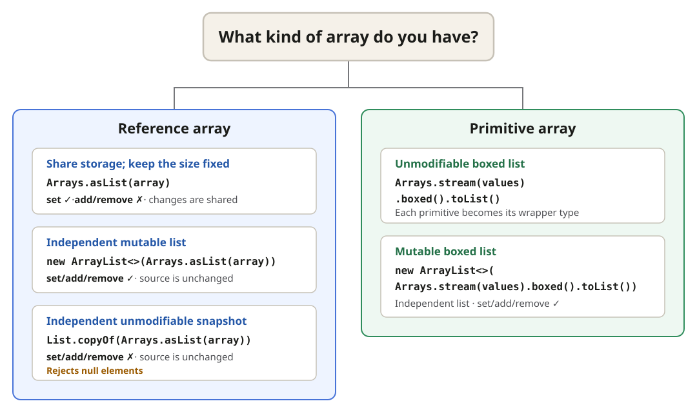

Choose a conversion based on the **array element type** and the required
**mutability**.

## Array → list



## List → reference array

```java
String[] names = list.toArray(String[]::new);
```

## Primitive-array details

- `boxed()` converts each `int` to an `Integer`.
- `Arrays.asList(values)` is a trap: it produces a **one-element `List<int[]>`**, not
  a `List<Integer>`.

## Boxed list → primitive array

```java
List<Integer> numbers = List.of(1, 2, 3);
int[] values = numbers.stream().mapToInt(Integer::intValue).toArray();
```

Any **`null` element** causes a `NullPointerException` during unboxing.
