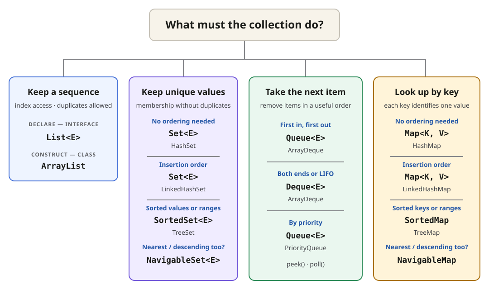
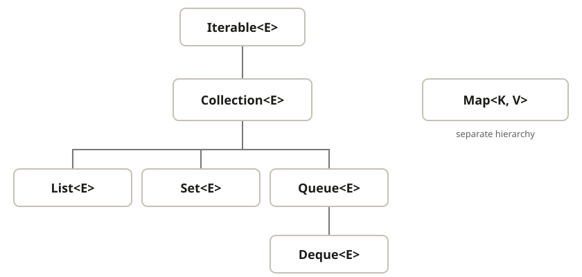

## Declare the interface; construct a class

| Need                                               | Declare              | Typical construction    |
| -------------------------------------------------- | -------------------- | ----------------------- |
| **Indexed sequence**; duplicates allowed           | `List<E>`            | `new ArrayList<>()`     |
| ---                                                |                      |                         |
| **Unique membership**                              | `Set<E>`             | `new HashSet<>()`       |
| **Insertion-ordered unique values**                | `Set<E>`             | `new LinkedHashSet<>()` |
| **Sorted values**; endpoints and ranges            | `SortedSet<E>`       | `new TreeSet<>()`       |
| **Nearest-value navigation**; descending order too | `NavigableSet<E>`    | `new TreeSet<>()`       |
| ---                                                |                      |                         |
| **FIFO processing**                                | `Queue<E>`           | `new ArrayDeque<>()`    |
| **Both ends or LIFO**                              | `Deque<E>`           | `new ArrayDeque<>()`    |
| **Priority processing**                            | `Queue<E>`           | `new PriorityQueue<>()` |
| ---                                                |                      |                         |
| **Unique-key lookup**                              | `Map<K, V>`          | `new HashMap<>()`       |
| **Insertion-ordered keys**                         | `Map<K, V>`          | `new LinkedHashMap<>()` |
| **Sorted keys**; endpoints and ranges              | `SortedMap<K, V>`    | `new TreeMap<>()`       |
| **Nearest-key navigation**; descending order too   | `NavigableMap<K, V>` | `new TreeMap<>()`       |

## See the interface hierarchy

## Similar names, different roles

- `Collection<E>` is the **common interface** behind **lists, sets, and queues**.
- `Collections` is a **utility class** containing static operations and wrappers.
- `Map<K, V>` belongs to the framework but does **not** extend `Collection<E>`.
