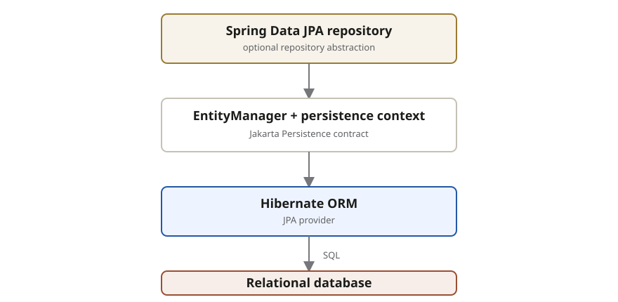

Jakarta Persistence (**JPA**) is the standard contract for mapping Java objects to
relational data. `EntityManager` is its central API; Hibernate is a common provider,
and Spring Data JPA adds repository abstractions on top.

| Layer                      | Responsibility                                            |
| -------------------------- | --------------------------------------------------------- |
| Spring Data JPA repository | Provides generated repository implementations             |
| JPA and `EntityManager`    | Define entity lifecycle and persistence operations        |
| Hibernate                  | Implements JPA and translates managed changes into SQL    |
| Relational database        | Stores rows and enforces database constraints and commits |

The key boundary is the **persistence context**. While an entity is managed inside
it, field changes can be detected and written without an explicit update call. Once
the entity is detached, that automatic tracking no longer applies.
