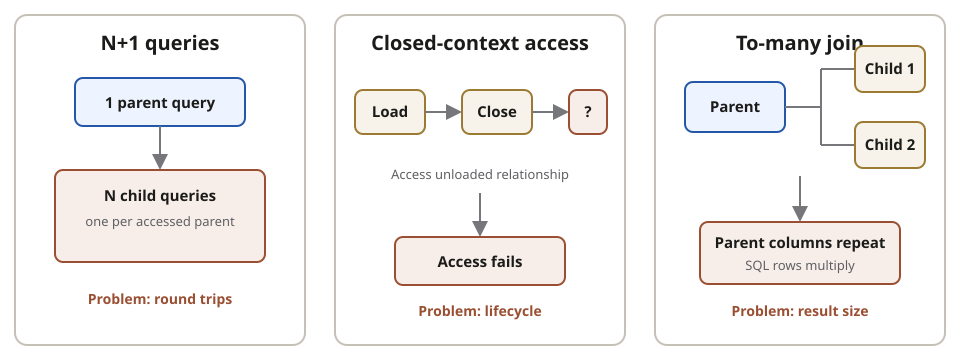
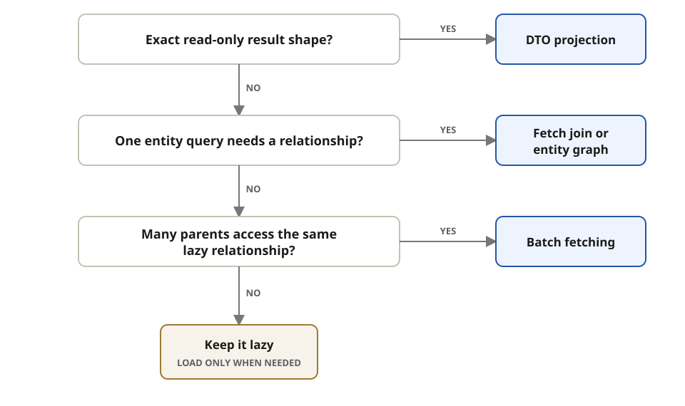

Start from the **result shape required by the use case**, not from a universal
**eager or lazy mapping rule**. Each loading tool solves a different query shape.



## Choose a loading tool

| Choice             | Use when                                                               | Main risk or limitation                                                                             |
| ------------------ | ---------------------------------------------------------------------- | --------------------------------------------------------------------------------------------------- |
| **Lazy loading**   | The relationship is **not normally needed**                            | Later access may cause **N+1 queries** or fail after the context closes                             |
| **Fetch join**     | One query needs a **bounded relationship** with its entities           | To-many joins **multiply SQL rows**; pagination needs special care                                  |
| **Entity graph**   | The **fetch plan** should vary without embedding every choice in JPQL  | It controls the fetched graph, but the **provider still chooses the SQL**                           |
| **Batch fetching** | Many loaded parents later access the **same lazy relationship**        | Reduces N+1 round trips but still uses **multiple queries**; configuration may be provider-specific |
| **DTO projection** | A read-only API, list, report, or grid needs an **exact result shape** | Returns data rather than a **managed entity graph**                                                 |

## Fast decision path



## Query-scoped example

A **fetch join** states the relationship directly in JPQL:

```java
@Query("""
    select customer
    from Customer customer
    left join fetch customer.orders
    where customer.id = :id
    """)
Optional<Customer> findWithOrders(@Param("id") UUID id);
```

Spring Data's **`@EntityGraph(attributePaths = "orders")`** can declare the required
relationship separately from the JPQL. Use a **projection** instead when the caller
needs selected values rather than entities and their lifecycle behavior.

## Recognize the SQL shape

| Observed shape                                              | Likely interpretation                        |
| ----------------------------------------------------------- | -------------------------------------------- |
| One parent query followed by **one child query per parent** | **N+1 relationship loading**                 |
| Parent query followed by **grouped child queries**          | **Batch fetching** reduced the round trips   |
| One join with **repeated parent columns**                   | A **to-many fetch join** multiplied SQL rows |
| One query selecting **only required columns**               | **DTO or scalar projection**                 |

Entity counts alone can hide the problem: JPA may rebuild fewer entity objects from
many repeated SQL rows. Inspect **queries, returned rows, round trips, and pages**.

## Guardrails

| Watch for                                                          | Prefer                                                                                                            |
| ------------------------------------------------------------------ | ----------------------------------------------------------------------------------------------------------------- |
| **Lazy state** accessed after the persistence context closes       | Fetch required data **inside the transaction boundary**                                                           |
| Making **every relationship eager** to avoid loading failures      | Choose a **fetch plan per use case** instead of replacing hidden queries with over-fetching                       |
| **To-many fetch join combined with pagination**                    | **Page parent IDs first**, use a DTO projection, or use batch fetching; verify the **number of parents per page** |
| **Open EntityManager in View** hiding queries during web rendering | Keep **service fetch requirements explicit** and treat it as a deliberate application choice                      |

To-many fetch-join pagination is **provider-, database-, and version-sensitive** and
may require expensive in-memory limiting. Measure the SQL rather than assuming the
Java result shape proves the query is efficient.

## References

- [Jakarta Persistence specification](https://jakarta.ee/specifications/persistence/3.2/jakarta-persistence-spec-3.2.html)
- [Hibernate ORM User Guide](https://docs.hibernate.org/orm/current/userguide/html_single/)
- [Spring Data JPA projections](https://docs.spring.io/spring-data/jpa/reference/repositories/projections.html)
