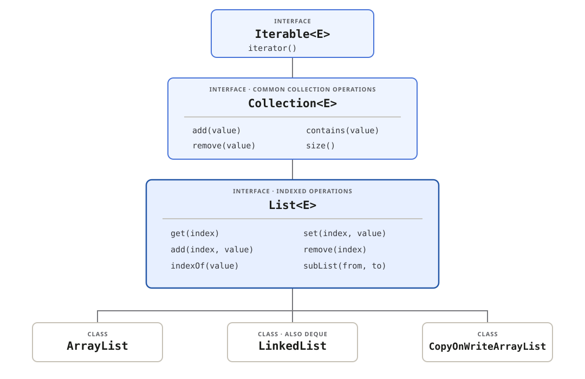

## Choose an implementation

| Implementation                                 | Use when                                              |
| ---------------------------------------------- | ----------------------------------------------------- |
| `ArrayList`                                    | The **default choice** for most list use              |
| `LinkedList`                                   | List and `Deque` behavior are both required           |
| `CopyOnWriteArrayList` or synchronized wrapper | Shared indexed access; see **Concurrent lists** below |

`LinkedList` does **not make arbitrary indexed insertion fast**: finding an index
still requires walking through the list.

## See the interface hierarchy and operations

