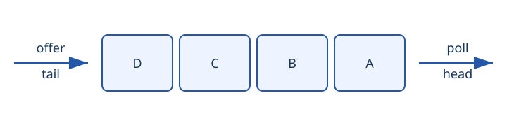

A queue holds elements for processing in a defined order. A FIFO queue removes the
element that has waited the longest.



## Core operations

```java
queue.offer(value);
queue.peek();
queue.poll();
```
