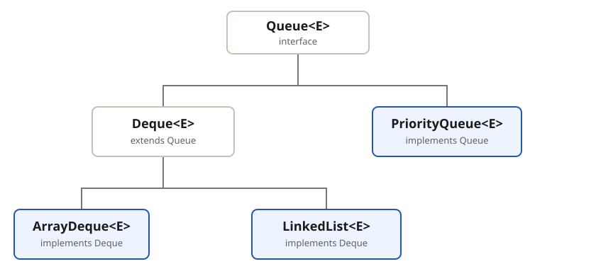

A queue holds elements before processing; its implementation defines their order. A
**FIFO** queue removes the element that has **waited longest**.

## Choose an implementation



| Implementation                             | Ordering                               | Use when                                                         |
| ------------------------------------------ | -------------------------------------- | ---------------------------------------------------------------- |
| `ArrayDeque`                               | FIFO when used as a queue              | The **default choice** for an ordinary queue                     |
| `LinkedList`                               | FIFO when used as a queue              | **Linked-list behavior** is also required                        |
| `PriorityQueue`                            | Heap using natural or comparator order | Process by **priority, not insertion order**                     |
| `ConcurrentLinkedQueue` or `BlockingQueue` | FIFO or priority                       | Shared producer-consumer access; see **Concurrent queues** below |

## `Queue` interface operations

These methods are defined by `Queue<E>` and are available **regardless of the chosen
implementation**.

```java
Queue<String> queue = new ArrayDeque<>();
```

| Intent       | Throws when it cannot succeed | Returns a special value |
| ------------ | ----------------------------- | ----------------------- |
| Insert       | `add(e)`                      | `offer(e)` → `false`    |
| Examine head | `element()`                   | `peek()` → `null`       |
| Remove head  | `remove()`                    | `poll()` → `null`       |

Use the special-value methods when a **full or empty** queue is an **expected outcome**.


