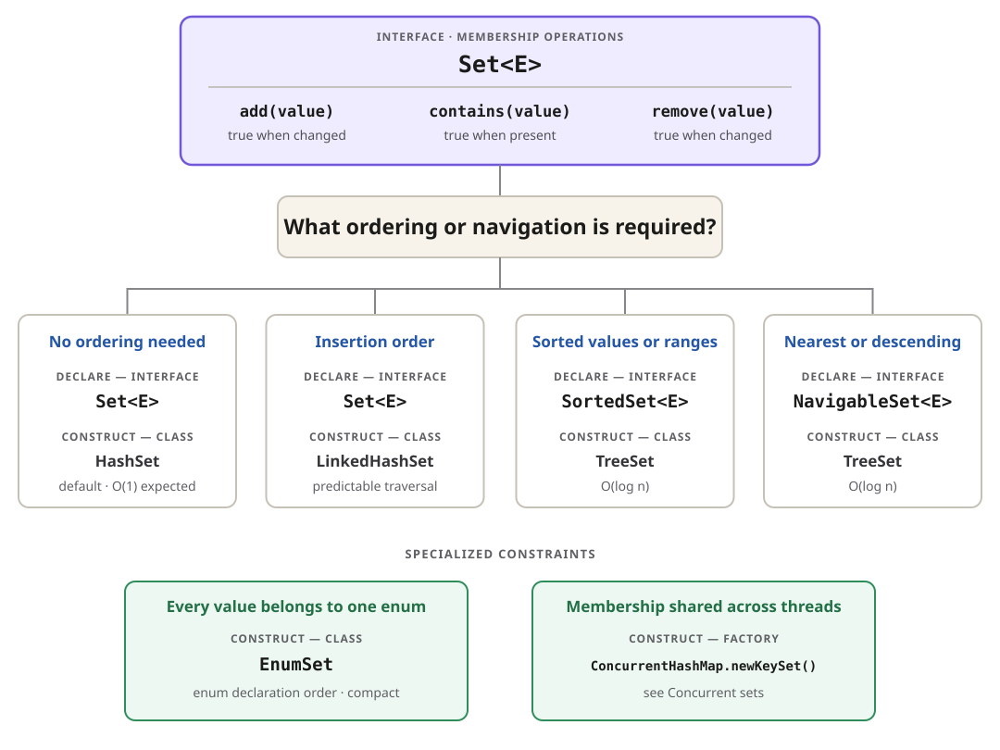

## Choose and use a set

## Operations between collections

Given `left = {1, 2, 3}` and `right = {3, 4}`, these operations mutate `left`:

| Intent                           | Java operation          | `left` afterward |
| -------------------------------- | ----------------------- | ---------------- |
| Include elements from either set | `left.addAll(right)`    | `{1, 2, 3, 4}`   |
| Keep elements present in both    | `left.retainAll(right)` | `{3}`            |
| Remove elements present in right | `left.removeAll(right)` | `{1, 2}`         |
