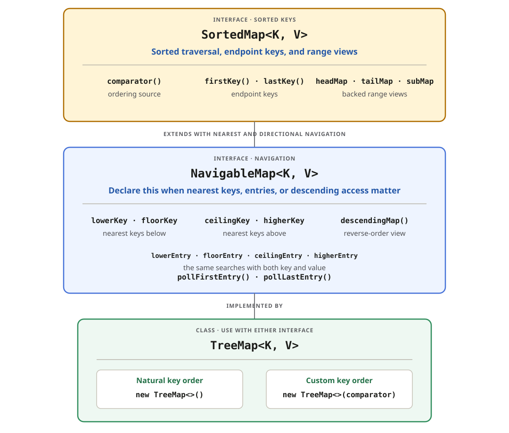

> **Need the mapping, not only its key?** The `...Key(...)` methods return a key;
> the corresponding `...Entry(...)` methods return both the key and value.
>
> **Need to consume an endpoint?** `firstEntry()` and `lastEntry()` inspect the
> endpoint mappings. `pollFirstEntry()` and `pollLastEntry()` return and remove
> them in one call.

## Define the key ordering

Natural ordering requires mutually comparable keys, normally through `Comparable`.
Alternatively, provide a `Comparator` when creating the map. The same ordering
controls iteration and all navigation methods below.

## Closest matches

| Method            | Result relative to `key` |
| ----------------- | ------------------------ |
| `lowerKey(key)`   | Greatest key `< key`     |
| `floorKey(key)`   | Greatest key `<= key`    |
| `ceilingKey(key)` | Least key `>= key`       |
| `higherKey(key)`  | Least key `> key`        |

`firstKey()` and `lastKey()` throw `NoSuchElementException` when the map is empty.
The nearest-match methods and `firstEntry()` or `lastEntry()` return `null` when
no matching entry exists.

## Range views

```java
NavigableMap<Integer, String> selected = values.subMap(20, true, 50, false);
```

The result contains keys from **20 inclusive to 50 exclusive**. It is a
**backed view**: changes through the view affect the original map, and accepted new
keys must remain within its range.
