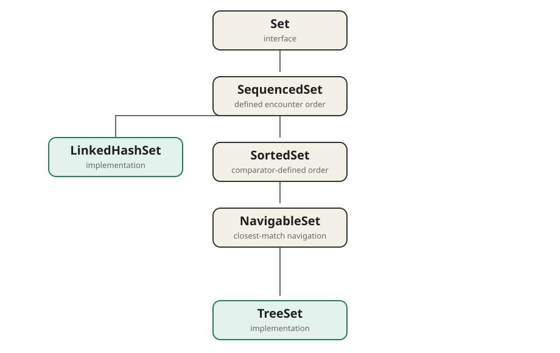

`TreeSet` implements `NavigableSet`, which adds closest-match and range operations to
a sorted set.



## Choose the ordering

| Required order     | Construction                                      |
| ------------------ | ------------------------------------------------- |
| Natural, ascending | `new TreeSet<Integer>()`                          |
| Custom             | `new TreeSet<Integer>(Comparator.reverseOrder())` |

Natural ordering requires mutually comparable elements, normally through
`Comparable`. Alternatively, provide a `Comparator` when creating the set.
`TreeSet` maintains that order as elements are added; the same order controls
iteration and all navigation methods below.

## Closest matches

| Method           | Result relative to `value`  |
| ---------------- | --------------------------- |
| `lower(value)`   | Greatest element `< value`  |
| `floor(value)`   | Greatest element `<= value` |
| `ceiling(value)` | Least element `>= value`    |
| `higher(value)`  | Least element `> value`     |

`first()` and `last()` return the endpoints and throw `NoSuchElementException` when
the set is empty. `pollFirst()` and `pollLast()` return and **remove** the endpoints,
or return `null` when the set is empty.

## Range views

```java
NavigableSet<Integer> selected = values.subSet(20, true, 50, false);
```

The result contains values from **20 inclusive to 50 exclusive**. It is a
**backed view**: changes through the view affect the original set, and accepted new
values must remain within its range.
