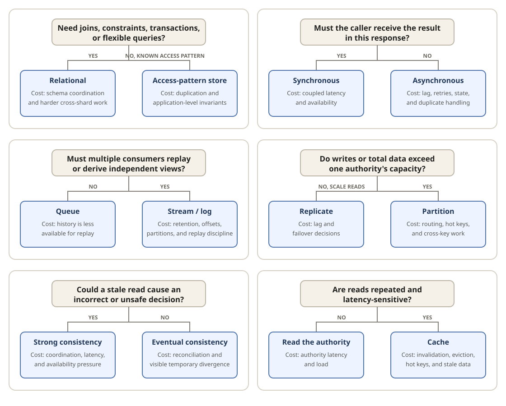

Start with what **must be true**. Choose the simplest bias that satisfies that
requirement, name its cost, and revisit it when the requirement changes.

## Choose from the requirement

| Ask                                                         | If yes                                                        | If no                                                        |
| ----------------------------------------------------------- | ------------------------------------------------------------- | ------------------------------------------------------------ |
| Need joins, constraints, transactions, or flexible queries? | **Relational** — schema coordination and harder sharding      | **Access-pattern store** — duplication and application rules |
| Must the caller receive the result in this response?        | **Synchronous** — coupled latency and availability            | **Asynchronous** — lag, retries, state, and duplicates       |
| Must consumers replay or derive independent views?          | **Stream or log** — retention, offsets, and replay discipline | **Queue** — less history available for replay                |
| Do writes or total data exceed one authority's capacity?    | **Partition** — routing, hot keys, and cross-key work         | **Replicate** — scale reads; lag and failover decisions      |
| Could a stale read cause an incorrect or unsafe decision?   | **Strong consistency** — coordination and latency             | **Eventual consistency** — reconciliation and divergence     |
| Are reads repeated and latency-sensitive?                   | **Cache** — invalidation, eviction, hot keys, and stale data  | **Read the authority** — authority latency and load          |

## State the decision

Use this form in a design discussion or interview: because **[requirement]** must be
true, start with **[choice]**. This costs **[trade-off]**. Revisit it when
**[trigger]** changes.

These choices are biases, not universal either-or rules. A system may combine them
at different boundaries—for example, a cache still has an authority, and a
partitioned store may also replicate each partition.
