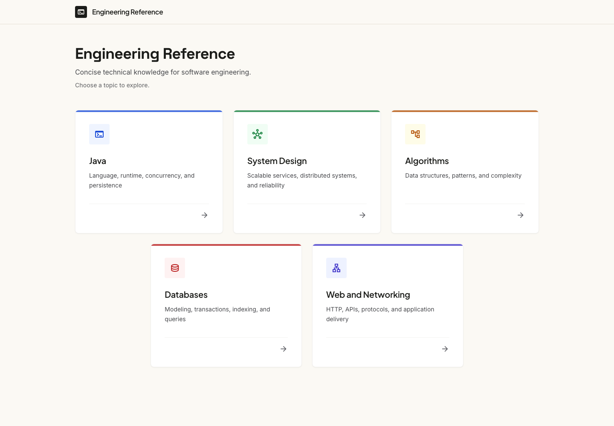
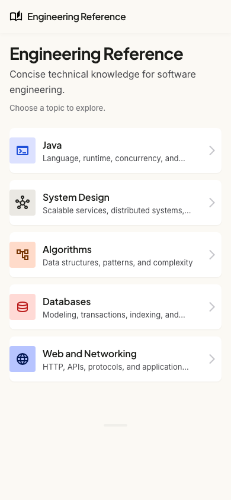
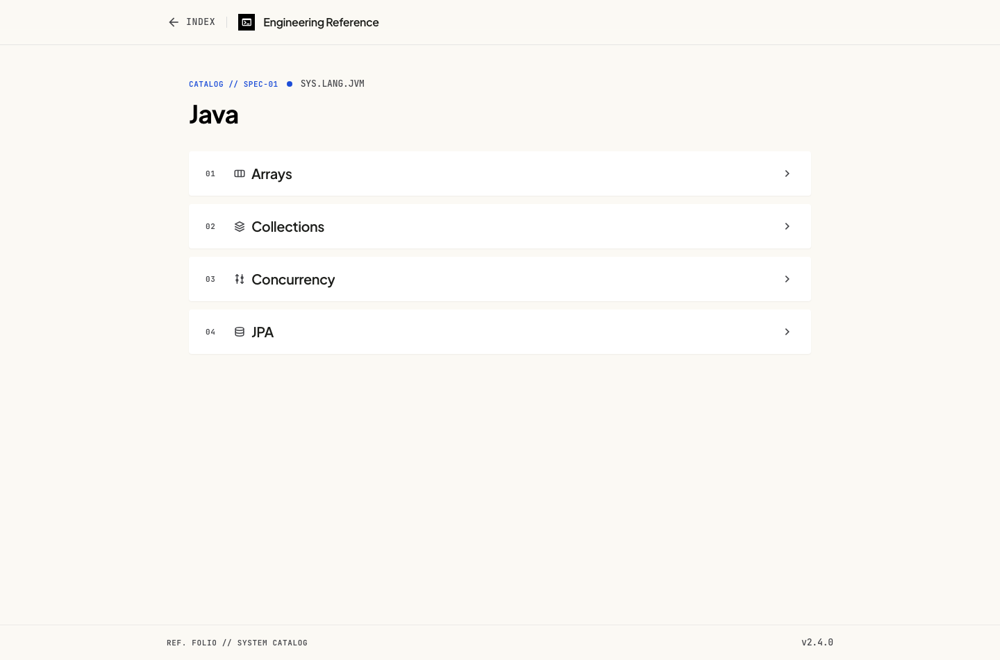
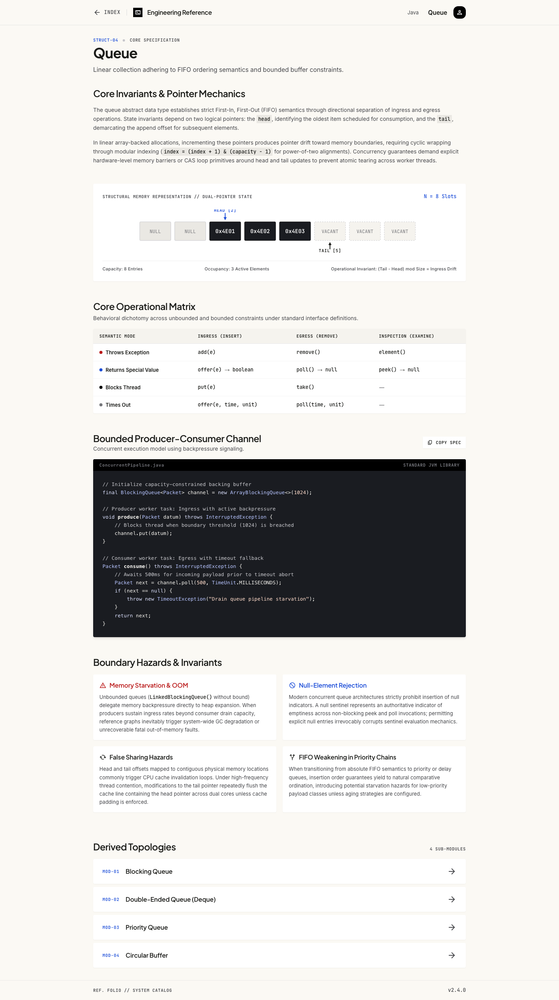
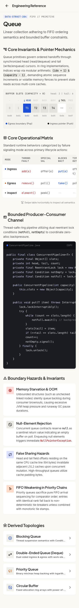

# Engineering Reference Visual Design

## Status and authority

This document defines the accepted visual direction. It translates
the [product brief](product-brief.md), [content model](content-model.md), and
[navigation and responsive interaction model](interaction-model.md) into an
implementation-facing presentation system.

The accepted MVP references remain authoritative for the existing shell, child
navigation, Topic content, palette, typography, and surface language. Their
hierarchy-prominent landing composition is superseded by the browse-first
Direction C landing below. Direction C extends the system with persistent search,
primary domain entry, classified all-Topics browsing, Browse contexts, and
Related Topics. Those new surfaces follow the constraints below; they do not
make synthetic prototype details authoritative.

The Direction C sections define accepted target presentation. They are not a
claim that the current application or reference screenshots already include
those surfaces; bounded implementation and verification follow separately.

The selected concepts were produced with Google Stitch and accepted during
[issue #33](https://github.com/gmatossian/engineering-reference/issues/33). The
reference images below preserve the selected visual direction. They are not
pixel-perfect specifications, and their synthetic copy and invented UI do not
override the repository's governing product documents.

The raw Stitch export and generated HTML are exploratory inputs. They are not
versioned, are not application source, and must not be copied into the Angular
application wholesale.

## Direction summary

Engineering Reference uses a contemporary digital card-catalog direction. It
should feel calm, purposeful, and unmistakably interactive while retaining the
clarity and authority of a carefully maintained technical reference.

The direction was selected because it:

- gives a deliberately sparse catalog enough visual structure without adding
  product functionality;
- distinguishes primary domain discovery from secondary curated paths and
  child navigation;
- uses typography and iconography to improve recognition and hierarchy;
- supports both short navigation-only Topics and dense content-bearing Topics;
- supports direct title retrieval, classified browsing, and contextual onward
  navigation without turning the product into a dashboard; and
- avoids resembling a word-processing document, generic dashboard, terminal,
  or documentation-site template.

## Visual foundations

### Color

The base palette is warm and restrained:

| Role | Reference value | Use |
| --- | --- | --- |
| Canvas | `#fbf9f4` | Page background |
| Card | `#ffffff` | Navigational cards, rows, and bounded content surfaces |
| Primary text | `#1b1c19` | Headings and primary labels |
| Secondary text | `#46474b` | Supporting text |
| Hairline | `#e5e0d5` | Borders and dividers |
| Strong outline | `#76777b` | Focus and emphasized boundaries where appropriate |

The implementation uses restrained accent families for related icon concepts:

- cobalt for languages and runtimes;
- forest green for architecture and concurrency;
- warm ochre for algorithms and complexity;
- terracotta for databases and persistence; and
- indigo for collections, data structures, and general operations.

Accents belong on icons, narrow rules, borders, and subtle tinted surfaces.
Large saturated fills are not part of this direction. Color must not be the
only way an item communicates its meaning or state.

These families guide the shared visual and icon system; they are not authored
Topic metadata, and authors do not select colors. The landing page assigns a
stable icon and accent treatment to each supported domain as UI presentation
so the destinations are easier to recognize. Color does not carry
classification meaning by itself. A Topic icon key likewise receives a
consistent default treatment in the UI.

### Typography

Typography supplies much of the interface's hierarchy:

| Role | Preferred family | Character |
| --- | --- | --- |
| Application identity and headings | Plus Jakarta Sans | Distinctive, compact, and contemporary |
| Body and navigation | Plus Jakarta Sans | Humanist, approachable, and readable at interface and reference densities |
| Code | JetBrains Mono | Reserved for authored code and inline technical notation |

The page title, introductory copy, Topic titles, supporting text, and body
content must remain visibly distinct through size, weight, line height, and
spacing. Tiny uppercase metadata is not part of the product. Font loading and
fallback strategy are implementation details and must preserve performance and
readability.

The initial implementation loads Plus Jakarta Sans and JetBrains Mono from Google
Fonts and retains system-font fallbacks. This is an external runtime dependency;
self-hosting should be reconsidered before publication if offline availability or
third-party request privacy becomes a requirement.

### Spacing, shape, and depth

- Use an 8-pixel base rhythm, with 4-pixel increments for fine alignment.
- Prefer restrained radii: approximately 4 pixels for small controls and 8
  pixels for cards and rows.
- Separate surfaces primarily with spacing, hairline borders, and small
  contrast changes.
- Use only subtle shadows. Clickable landing domain entries and curated Topic
  rows may lift by approximately 2 pixels on hover when motion preferences
  allow it.
- Keep a generous but bounded central canvas. Prose should retain a readable
  line length while tables, code blocks, and images may use the wider content
  measure.

## Application shell

The header is compact and persistent across views:

- **Home** is the Engineering Reference identity and application mark.
- **Back** remains visible and retains the browser-history behavior defined by
  the interaction model. It is presented as unavailable when it has no
  destination.
- **All topics** is a persistent text destination for the complete browse and
  search surface. It must not be represented by an unexplained icon.
- **Search topics** is a compact inline field on spacious layouts. At narrow
  widths it becomes a labelled icon control that expands the field within the
  header.
- The landing reference omits Back, but implementation must preserve the
  visible unavailable state required by the interaction model.

Do not add per-domain global shortcuts, a canonical breadcrumb, profile
controls, or an application navigation drawer. The accepted All topics link is
plain product navigation rather than the synthetic `INDEX` label shown in some
prototypes. The terminal-like mark in some desktop concepts is illustrative;
the open-book mark in the mobile concepts better expresses a reference product.
Final vector execution belongs to implementation and must not introduce an
external UI framework implicitly.

## Landing presentation

The landing page begins with:

- the `Engineering Reference` title;
- the subtitle `Concise technical knowledge for software engineering.`

A **Browse by domain** region follows the introduction directly. It presents
every supported domain in canonical vocabulary order as native links to the
corresponding filtered all-Topics view. Domain entries are compact browse
controls rather than Topic cards: they show a stable domain icon and accent,
the domain display label, the current matching-Topic count, and a navigation
cue. Their icons are UI vocabulary rather than borrowed Area Topic identity.
At spacious widths they form a balanced multi-column grid; they reflow through
fewer columns to one full-width entry per row when content fit requires it.

A visually quieter **Curated paths** region follows the primary discovery
controls. Its heading and supporting copy identify the entries as selected
Topic overviews with optional narrower paths. It renders the ordered
`landingTopicIds` as direct canonical Topic links using each Topic's title,
summary, and optional decorative icon. These entries preserve useful
broad-to-specific journeys without resembling another set of domain controls.
They use compact rows or a restrained small grid and must not visually
outweigh the domain region.

The separation between **Browse by domain** and **Curated paths** is conveyed
by headings and supporting text, not color or icons alone. A domain link and a
same-named Area Topic may both be present: `System Design` under Browse by
domain opens `/topics?domain=system-design`, while `System Design` under
Curated paths opens its canonical Topic overview.

### Accepted low-fidelity compositions

The wide landing composition uses the real closed domain vocabulary and the
current curated landing Topics:

```text
Engineering Reference
Concise technical knowledge for software engineering.

Browse by domain
[ Java ]         [ Collections ]   [ Concurrency ]   [ Persistence ]
[ Databases ]    [ HTTP ]          [ System Design ] [ Algorithms and data structures ]

Curated paths
Selected Topic overviews with optional narrower paths
[ Java — Core language, collections, concurrency, and persistence concepts. ]
[ System Design — Estimate workloads and choose structures and services that meet scale and reliability needs. ]
[ HTTP — Common response status codes, redirects, required headers, and retry implications. ]
[ Databases — Use SQL window functions for ranking, running calculations, and row-to-row comparisons. ]
```

The narrow composition preserves the same priority and document order rather
than introducing mobile-only navigation:

```text
Engineering Reference
Concise technical knowledge for software engineering.

Browse by domain
[ Java ]
[ Collections ]
[ Concurrency ]
[ Persistence ]
[ Databases ]
[ HTTP ]
[ System Design ]
[ Algorithms and data structures ]

Curated paths
Selected Topic overviews with optional narrower paths
[ Java
  Core language, collections, concurrency,
  and persistence concepts. ]
[ System Design
  Estimate workloads and choose structures and
  services that meet scale and reliability needs. ]
[ HTTP
  Common response status codes, redirects,
  required headers, and retry implications. ]
[ Databases
  Use SQL window functions for ranking, running
  calculations, and row-to-row comparisons. ]
```

Exact wrapping thresholds, field widths, and decorative icon choices remain
implementation details. The order, relative emphasis, destinations, and
distinction between domain browsing and curated Topic paths do not.

## Topic presentation

A Topic view preserves the order required by the interaction model:

1. Topic title;
2. compact Browse contexts;
3. complete main content, when present;
4. ordered immediate-child navigation, when present; and
5. curated Related Topics, when present.

Browse contexts are a quiet orientation region, not a dashboard of badges. The
Topic's kind and domains are native links to their corresponding browse
filters, and derived parents are Topic links under a clear label such as `Found
in`. Wide layouts may place the region in a restrained side column; narrow
layouts keep it in document flow directly after the title. Visual placement
must preserve semantic and keyboard order.

Related Topics use a labelled region distinct from immediate children. They
may use the same compact link-row family, but the heading and supporting kind
or domain text must communicate that the links are lateral rather than
narrower. Empty context subgroups and an empty Related Topics region are not
rendered.

### Navigation-only Topics

Children use compact, uniform, full-width rows distinct from primary domain
entries and curated-path rows. Each row is one native link containing a
decorative icon, the child title, and a navigation chevron. Rows do not include
descriptions, sequence numbers, or opaque classification codes. Classification
belongs to the all-Topics and context surfaces rather than being inferred from
a child icon.

The region uses a relationship heading such as **Narrower topics**. It remains
visually secondary to main content and must not resemble the primary landing
domain grid or imply that following the hierarchy is necessary to find a
Topic.

Every Topic should display an icon when represented in navigation. Icons may
be reused, and the UI must provide a generic fallback when a specific icon is
not available. A Topic optionally selects a supported icon through `iconKey`;
the generated runtime value is `null` when no specific key is authored.

### Content-bearing Topics

Main content uses the same typography, surfaces, and spacing as the surrounding
application while retaining the semantic structure supplied by authored
Markdown. Generic presentation may style headings, prose, lists, links, images,
code, and tables. It must not infer Topic-specific components such as warning
cards, diagrams, status badges, or operation matrices from a Topic's identity.

The Queue concepts demonstrate density, hierarchy, and responsive behavior.
Their text, diagram, bespoke callout cards, copy action, and technical labels
are synthetic design material rather than canonical content or required UI.

Code blocks and tables use their generated, labelled
`topic-content-overflow` regions. Those regions own horizontal scrolling and
remain keyboard focusable; the page itself must not gain horizontal overflow.
Images scale within the content area without losing their alternative text or
semantic placement.

## All-Topics Presentation

The all-Topics page is a reference index, not a faceted analytics dashboard.
It begins with a clear `All topics` heading and short orientation text, followed
by one compact control region containing:

- native domain and kind controls;
- the result count; and
- a visible clear action when constraints are active.

The labelled title-search input remains in the persistent application header
rather than competing with the browse controls in the main content.

Controls use ordinary form labels and states rather than decorative chips.
Their boundaries, focus indicators, and selected values remain clear without
depending on color. At narrow widths they stack to the available measure; they
do not move into a modal, drawer, or horizontally scrolling toolbar.

The default index is an alphabetical vertical list. A domain view with no query
or kind filter first separates matching Area Topics into a labelled
**Overviews** region. Those rows retain the canonical title and visibly
identify their Area kind, so a result such as the System Design Topic is
recognizable as an optional overview rather than a second domain gateway.

The System Design domain then uses kind section headings for its remaining
results in accepted vocabulary order. Other domain views keep their remaining
results flat unless later evidence supports further grouping. Each Topic result
is a native link whose primary line is the title and whose supporting text
names its kind and domains so duplicate or ambiguous titles remain
understandable. The UI does not display UUIDs, storage directories, relevance
scores, internal taxonomy keys, or result numbers.

Search relevance changes ordering but not card size, color, or prominence.
The no-results state is calm and explicit, remains within the results region,
and keeps the search and filter controls available.

The accepted wide System Design view uses the real current classification:

```text
All topics
[ Domain: System Design ]  [ Kind: All ]  [ Clear all ]
7 topics

Overviews
  System Design                              Area · System Design

Operations
  Scale and estimation                       Operations · System Design

Decision aids
  Choosing storage                           Decision aid · System Design
  Pagination: offset vs cursor               Decision aid · System Design
  Short URL identifiers                      Decision aid · System Design
  Trade-off triggers                         Decision aid · System Design

Exercises
  URL shortener                              Exercise · System Design
```

At narrow widths the same controls and sections stack without hiding context:

```text
All topics
[ Domain: System Design          ]
[ Kind: All                      ]
[ Clear all                      ]
7 topics

Overviews
[ System Design
  Area · System Design           ]

Operations
[ Scale and estimation
  Operations · System Design     ]

Decision aids
[ Choosing storage
  Decision aid · System Design   ]
[ Pagination: offset vs cursor
  Decision aid · System Design   ]
[ Short URL identifiers
  Decision aid · System Design   ]
[ Trade-off triggers
  Decision aid · System Design   ]

Exercises
[ URL shortener
  Exercise · System Design       ]
```

## Interaction states

- Cards and rows must look actionable before interaction; a chevron alone is
  not the only affordance.
- Hover may adjust the border, surface, elevation, and chevron position without
  causing disruptive layout movement.
- Keyboard focus must use a clearly visible high-contrast outline with
  sufficient separation from the component boundary.
- Active states may reduce elevation or darken the surface slightly.
- Interaction motion should be short and restrained, and
  `prefers-reduced-motion` must be respected.
- Touch targets should be at least 44 by 44 CSS pixels even when their visible
  icon is smaller.

## Responsive behavior

Responsive layouts preserve content, order, semantics, and navigation:

- landing domain entries move from a multi-column grid to one full-width link
  per row, followed by the secondary curated paths;
- child navigation remains a vertical list of full-width rows;
- the header search expands within the header, while browse controls stack in
  logical document order;
- grouped index sections and result metadata remain visible rather than
  collapsing into icon-only or chip-only controls;
- Browse contexts move into the main flow directly after the Topic title;
- Related Topics remain a distinct vertical link region;
- typography and spacing reduce proportionally without becoming cramped;
- Topic main content follows normal vertical document flow;
- wide code and tables scroll inside their own bounded regions; and
- neither bottom navigation nor custom swipe navigation is introduced.

Tablet layouts interpolate between the accepted desktop and mobile references.
They do not introduce a third interaction model, a sidebar, or an off-canvas
navigation drawer.

## Accessibility requirements

- Cards and rows retain native link semantics and coherent accessible names.
- Search and filter controls retain visible labels and native form semantics.
- Kind and domain context remains available as text; icon and accent treatment
  never substitute for it.
- Group headings and result counts remain programmatically exposed.
- Topic icons are supplementary to visible titles and therefore hidden from
  assistive technology.
- The application mark and icon buttons receive appropriate accessible names.
- Text and essential boundaries must meet the project's WCAG 2.2 Level AA
  target.
- Meaning and state cannot depend on color, iconography, hover, or motion alone.
- Zoom, reflow, browser-history focus behavior, and bounded overflow continue
  to follow the interaction model.

## Explicit prototype exclusions

The reference screens contain exploratory details that must not become product
requirements. Exclude:

- catalogue, specification, system, or module identifiers;
- child sequence numbers and counts;
- `INDEX`, Java, or Queue shortcuts in the global header;
- technical footer labels and version numbers;
- Topic-specific profile, copy, or status controls;
- opaque taxonomy codes, decorative tag clouds, popularity badges, timestamps,
  and behavior-derived recommendations;
- swipe instructions and custom swipe behavior; and
- synthetic Queue content and bespoke content components.

When a reference image and this document disagree, this document and the
governing product documents prevail.

## Resolved presentation metadata

The generic content pipeline represents curated landing-Topic text through
`summary` and an optional specific icon through `iconKey`. Both values travel
from Topic front matter through validation and deterministic generation into
the shared runtime contract. Primary domain entries instead use the closed
domain vocabulary's generated labels and order; they do not borrow Topic
presentation metadata. The UI owns the generic icon fallback and all accent
treatment; there is no authored accent-family field.

This boundary preserves generic rendering and allows ordinary content to use
the supported presentation vocabulary without Topic-specific Angular code.

Domain and kind labels are likewise generated from the closed shared
vocabularies. Authors select semantic keys rather than colors, icons, badges,
or layout variants. Related Topics and Browse contexts resolve the referenced
Topic's canonical title and presentation metadata rather than duplicating
display text on relationships.

## Reference screens

The screenshots are durable visual references rendered from the selected
Stitch concepts. They contain synthetic content and some explicitly excluded
prototype details described above.

They predate Direction C and therefore do not specify the browse-first landing
composition, persistent search, all-Topics page, Browse contexts, or Related Topics. The
landing screenshots remain references for palette, typography, surface, and
interaction language rather than landing information hierarchy. A focused
later Stitch exercise may refine the accepted wide and narrow compositions
using real catalog data, but cannot reopen their discovery priority or
navigation semantics without another accepted product decision.

### Landing

[](design/reference/landing-desktop.png)

[](design/reference/landing-mobile.png)

### Navigation-only Topic

[](design/reference/navigation-topic-desktop.png)

[](design/reference/navigation-topic-mobile.png)

### Content-bearing Topic

[](design/reference/content-topic-desktop.png)

[](design/reference/content-topic-mobile.png)
