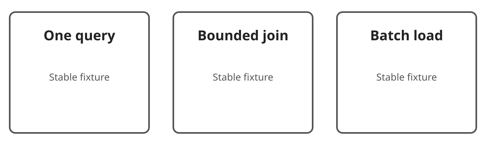

Start from the result shape required by the fixture journey.

## Choose a loading tool

Match the operation to the required result shape.

Use a bounded join when row multiplication remains acceptable.

## Guardrails

Measure the number of round trips and returned rows.

## References

- [Example reference](https://example.com/reference)
