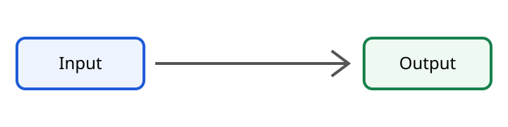

A shared path appears beneath both fixture branches so hierarchy behavior can be tested without
depending on the reference catalog.

## Common operations

```java
fixture.offer(value);
```



## Selection notes

Use the child entry to exercise navigation, history, focus, and generated table behavior.
